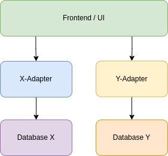

# Interoperable Distributed Architecture

In times of the meta crisis there are more and more projects, networks and application aiming to bring people together for change, collective action and manifesting new regenerative structures.

Every project and network has their specific focus and idea about change. At the same time it's also just a small puzzle piece inside a much bigger game without any centralized coordination. So we need to appreciate that their are myriads of ideas, apps and databases working in their way with their tools and technologies.

That’s why the big challenge of our time is to integrate all these puzzle pieces into that beautiful  but still vague picture that we dream up collectively in our mind's eyes.

There is no one to fix it all solution. The operating system of the future is modular: Every project should try to focus on it’s very specific job and try to offer the right interfaces to plug into this limitless ecosystem.

## Open Architecture

Our Goal is to connect various data sources with projects, people, events, resources and everything else needed for this transformation.

Instead of trying to agree on a shared data-format and specific technologies we should better focus on some design principles to enable all the different solutions to share its data and users and integrate with each other 

## Requirements

- Users can create, read, update and delete (CRUD) data items
- Single data items can be owned by a user or group of users
- Single data items can belong to one or more networks
- Different Networks running different databases
- Frontends can connect with one or more databases
- Adapters allow frontends to perform CRUD operations on different databases
- Users can store different credentials to authenticate on different databases
- Databases can be server-based or p2p
- Data items should have semantic relations with each other

## Implementation

To implement this, we propose a layered approach. The foundational layer consists of various databases, each serving different networks. These databases could be either server-based or peer-to-peer (p2p), depending on the needs and resources of the network.

The next layer is the Adapters. These are designed to facilitate the interaction between frontends and databases. They allow frontends to perform create, read, update, and delete (CRUD) operations on different databases, ensuring a smooth flow of data.

The third layer comprises the frontends, which are the interfaces that users interact with. These frontends can connect with one or more databases, providing users with the flexibility to access and manage data across different networks.

Finally, at the topmost layer, we have the users. Users can store different credentials to authenticate on different databases, allowing them to own and manage data items.

By breaking down the system into these distinct but interconnected layers, we can ensure that every part of the system can function independently while also working together. This modular approach not only enhances the system's flexibility but also improves its scalability and reliability.

